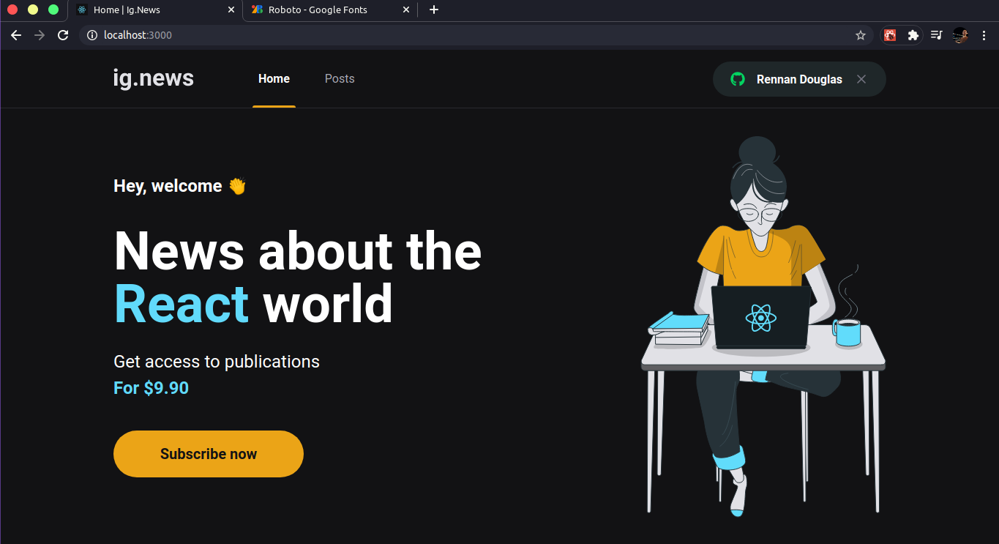

<h1 align="center" >
    
</h1>

<h1 align="center"> Hey, welcome 👏 </h1>

<h2 align="center"> 
    News about the React world
</h2>

<h3 align="center">
  This app has developed using React with Next Js.
</h3>

# Cloning this repository

```
$ git clone https://github.com/RennanD/ignews.git
```

# ❗️ Requisites

For this aplication we need have installed:

- [Node](https://nodejs.org/en/)
- [Yarn](https://yarnpkg.com/lang/en/) (Optional)

## 💻 Web Application

<h1 align="center">
    
</h1>

<h3 align="center">
This application consists of a newsletter, which informs subscribers of the main news about the React ecosystem
</h3>

<p>
  In this project we use:
</p>

- [Stripe](https://stripe.com/br), for the payment controller.
- [FaunaDB](https://fauna.com/), for database.
- [Prismic](https://prismic.io/), for your CSM

### ⚡️ Start

To start application, run:

```
$ cd ignews
$ yarn
$ yarn dev
```

Open Your app is runnig on [localhost:3000](http://localhost:300)

# App Demo

<h1 align="center">
    
</h1>
